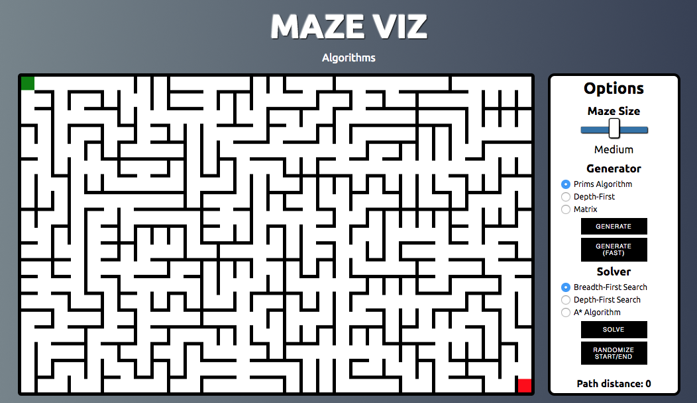

# Maze-Viz

[Live](http://glenn.tig.as/maze-viz/)

Maze Viz is a series of visualizations built using JavaScript and HTML5 Canvas that showcases different maze generating algorithms and maze solving algorithms.




## Implementation
The core behind Maze Viz is the maze components, specifically the `Maze` class and the `Cell` class. The `Maze` class contains the grid itself, which is a 2D array containing all of the grids cells. The `Cell` class keeps track of its state for the different generators/solvers as well as information regarding its position in the maze. To render it on the screen, the `Cell` class will render as a different color depending on its state, (transparent if not created, white if created, etc.)

## Maze Generation
For each of the maze-generators, the basic functionality is that they take in a `Maze` and until every has been added to the maze(i.e. `cell.created === true`), they run their algorithm.


### Random generator
For my implementation of a random-step generator, the algorithm takes the upper-left cell and adds it to the maze. Each of the neighboring cells of the starting point is added to a `frontier` array. Then, until all cells have been added to the maze:

1. Select a random cell from the frontier.
2. Add that cell to the maze, connecting it to a random neighboring cell already in the maze.
3. Add the random cells neighbors (not already in the maze) and add it to the frontier.

Neighbors to each cell are found taking the deltas for North, South, East and West and finding which cell is located at each of those positions.

```js
// cell.js
...
const DIRS = {
  'N': [-1,0],
  'E': [0,1],
  'S': [1,0],
  'W': [0,-1],
}

neighbors(){
  const neighbors = [];
  Object.keys(DIRS).forEach( dir =>{
    let neighborPos = [this.pos[0] +  DIRS[dir][0], this.pos[1] + DIRS[dir][1]]
    if (this._isInvalidPosition(neighborPos)) return;

    let neighbor = this.maze.getCell(neighborPos);
    neighbors.push(neighbor)
  });

  return neighbors
}
...
```

One of the challenges I faced with both maze generation and solving is animating the process. The algorithm is actually ran almost instantly which made it difficult to animate cleanly. To fix this, generator and solver algorithms utilize a `setTimeout` function with a 0ms delay. This allows each of the algorithm calculations to be added to the queue and performed one by one, which offers enough delay to be able to show a smooth animation of each action.

## Maze Solving
Similar to maze-generation, each solver is ran until either all cells have been visited (i.e `cell.visited === true`), or the ending has been found (`currentCell === maze.end`)

### Breadth-first
Breadth-first search involves exploring the maze each possible moves from the start. For each of those possible moves, all possible moves are explored. This process is repeated until the maze is solved.
### Depth-first
Depth-first search will explore the maze by exploring each path as far as it will go. If it reaches a point where it cannot traverse any further, the algorithm will explore the most recent possible branch until the maze is solved.
### A*
For my implementation of the A* algorithm, each cell in the mazes frontier is assigned a distance based on how far it is away from the ending cell (using the Manhattan distance heuristic). The algorithm then picks cell with the lowest distance and adds its neighbors to the frontier. The A* is different than both the breadth-first search and depth-first search because of how it uses the knowledge of where the end point is to guide its decision-making.

```js
// aStar-solver.js
...
getBestCell(){
  let closestCell = null;
  let distance = 10000;
  this.frontier.forEach( cell => {
    if (cell.distance < distance) {
      closestCell = cell
      distance = cell.distance
    }
  });

  // Remove cell from the frontier and return it
  this.frontier.splice(this.frontier.indexOf(closestCell), 1)
  return closestCell
}
...
```

The strength of the A* search is very evident using the Matrix or grid style maze where due to the openness of the maze, the algorithm will always travel directly (or as close to directly as it can) to the end.

## Cell Rendering
To help more clearly show the inner workings of each of the processes, cells are rendered in a different color based on its state.
- When the cell is marked as the `currentCell`, it is rendered red to help the user follow along with the algorithm.
- During solving, the cells are are rendered along a gradient from green to pink, showing how far along they are in the process. This is achieved using a reference to which iteration of the algorithm each cell is being processed at and using that number to calculate an RGB value.

```js
// cell.js
render(){
  ...
  if (this.visited) {
    const r = Math.floor(this.i * 0.14)
    const g = 240 - Math.floor(this.i * 0.439)
    const b =  Math.floor(this.i * 0.439)
    this.ctx.fillStyle = `rgb(${r},${g},${b})`
  }
  ...
}
```
- After finding the end point, the cells along the path are rendered yellow and traced back to the starting point.
